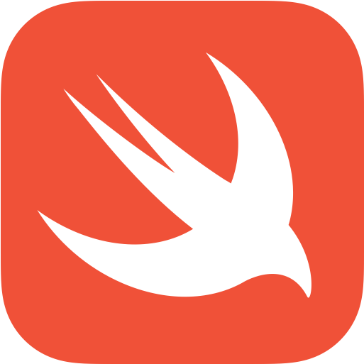

<!-- PROJECT SHIELDS -->
[![Contributors][contributors-shield]][contributors-url]
[![Forks][forks-shield]][forks-url]
[![Stargazers][stars-shield]][stars-url]
[![Issues][issues-shield]][issues-url]
[![Discussions][discussions-shield]][discussions-url]
[![Feature Requests][featurerequest-shield]][featurerequest-url]
[![License][license-shield]][license-url]

<!-- PROJECT LOGO -->
 

  

  <h1 align="center">SwiftUI Concurrency Essentials</h1>

  

    An introduction to using Swift's new concurrency features in SwiftUI
     
     
    <a href="https://github.com/peterfriese/SwiftUI-Concurrency-Essentials/discussions">Discuss with me</a>
    ·
    <a href="https://github.com/peterfriese/SwiftUI-Concurrency-Essentials/issues/new?assignees=&labels=&template=bug_report.md&title=">Report Bug</a>
    ·
    <a href="https://github.com/peterfriese/SwiftUI-Concurrency-Essentials/issues/new?assignees=&labels=&template=feature_request.md&title=">Request Feature</a>
  

# Articles and videos

The code in this repository accompanies a series of articles and videos that aim at providing a gentle introduction to Swift Concurrency in the context of SwiftUI.

* [x] Getting started with Swift Concurrency in SwiftUI ([Article](https://peterfriese.dev/swiftui-concurrency-essentials-part1/) | [Video](https://youtu.be/pvtWLmSRimk))
* [ ] Fetching images asynchronoursly using `AsyncImage`
* [ ] Using Task cancellation for more efficient UIs
* [ ] Running work in parallel with Swift Structured Concurrency
* [ ] Using Firebase's asynchronous APIs with async/await
* [ ] Refactoring and other tooling
* [ ] Swift Concurrency and SwiftUI behind the scenes

# Contributing

Contributions are welcome!

* If you found a typo in an article or a bug in one of the samples, consider [filing a bug report](https://github.com/peterfriese/SwiftUI-Concurrency-Essentials/issues/new?assignees=&labels=&template=bug_report.md&title=)
* Even better, consider fixing the bug and sending me a PR
* If you've got suggestions for other things I should write/talk about, send me a [feature request](https://github.com/peterfriese/SwiftUI-Concurrency-Essentials/issues/new?assignees=&labels=&template=feature_request.md&title=)
* Want to discuss w/ me and the other folks on this repository? Come on over to the [discussions forum](https://github.com/peterfriese/SwiftUI-Concurrency-Essentials/discussions)!

# Requirements

* Xcode 13
* Swift 5.5

# License

Distributed under the Apache 2 License. See `LICENSE` for more information.

<!-- MARKDOWN LINKS & IMAGES -->
<!-- https://www.markdownguide.org/basic-syntax/#reference-style-links -->
[contributors-shield]: https://img.shields.io/github/contributors/peterfriese/SwiftUI-Concurrency-Essentials.svg?style=flat-square
[contributors-url]: https://github.com/peterfriese/SwiftUI-Concurrency-Essentials/graphs/contributors
[forks-shield]: https://img.shields.io/github/forks/peterfriese/SwiftUI-Concurrency-Essentials.svg?style=flat-square
[forks-url]: https://github.com/peterfriese/SwiftUI-Concurrency-Essentials/network/members
[stars-shield]: https://img.shields.io/github/stars/peterfriese/SwiftUI-Concurrency-Essentials.svg?style=flat-square
[stars-url]: https://github.com/peterfriese/SwiftUI-Concurrency-Essentials/stargazers
[issues-shield]: https://img.shields.io/github/issues/peterfriese/SwiftUI-Concurrency-Essentials.svg?style=flat-square
[issues-url]: https://github.com/peterfriese/SwiftUI-Concurrency-Essentials/issues
[license-shield]: https://img.shields.io/github/license/peterfriese/SwiftUI-Concurrency-Essentials.svg?style=flat-square
[license-url]: https://github.com/peterfriese/SwiftUI-Concurrency-Essentials/blob/master/LICENSE.txt

[linkedin-shield]: https://img.shields.io/badge/-LinkedIn-black.svg?style=flat-square&logo=linkedin&colorB=555
[linkedin-url]: https://www.linkedin.com/in/peterfriese
[product-screenshot]: images/screenshot.png

[swift-shield]: https://img.shields.io/badge/swift-5.4_trunk-FA7343?logo=swift&color=FA7343&style=flat-square
[swift-url]: https://swift.org

[xcode-shield]: https://img.shields.io/badge/xcode-12.5_beta-1575F9?logo=Xcode&style=flat-square
[xcode-url]: https://developer.apple.com/xcode/

[featurerequest-url]: https://github.com/peterfriese/SwiftUI-Concurrency-Essentials/issues/new?assignees=&labels=type%3A+feature+request&template=feature_request.md
[featurerequest-shield]: https://img.shields.io/github/issues/peterfriese/SwiftUI-Concurrency-Essentials/feature-request?logo=github&style=flat-square
[discussions-url]: https://github.com/peterfriese/SwiftUI-Concurrency-Essentials/discussions
[discussions-shield]: https://img.shields.io/badge/discussions-brightgreen?logo=github&style=flat-square